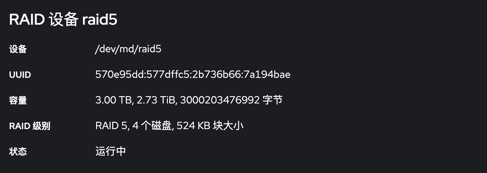

# Raid性能测试

测试代码

```shell
#!/bin/bash

[ $(id -u) -ne 0 ] && exec sudo "$0" "$@"

IF=/dev/random
OF=/dev/null
TF=$(basename $0).test
#OFLAG="oflag=dsync"

# benchmark bs count
benchmark() {
    echo -e "\n== benchmark: bs=$1, count=$2"

    # write
    dd if=$IF of=$TF bs=$1 count=$2 $OFLAG

    # drop caches
    echo 3 > /proc/sys/vm/drop_caches

    # read
    dd if=$TF of=$OF bs=$1

    # clean
    rm -f $TF
}

rm -f $TF
benchmark 1M 10240   # 10G
benchmark 8K 1310720 # 10G
```

[tuneraid.sh](https://ubuntuforums.org/showthread.php?t=1494846)

## Raid5



### btrfs

Before `tuneraid.sh`

```
== benchmark: bs=1M, count=10240
10240+0 records in
10240+0 records out
10737418240 bytes (11 GB, 10 GiB) copied, 34.8274 s, 308 MB/s
10240+0 records in
10240+0 records out
10737418240 bytes (11 GB, 10 GiB) copied, 43.1542 s, 249 MB/s

== benchmark: bs=8K, count=1310720
1310720+0 records in
1310720+0 records out
10737418240 bytes (11 GB, 10 GiB) copied, 37.2281 s, 288 MB/s
1310720+0 records in
1310720+0 records out
10737418240 bytes (11 GB, 10 GiB) copied, 44.345 s, 242 MB/s
```

After `tuneraid.sh`

```
== benchmark: bs=1M, count=10240
10240+0 records in
10240+0 records out
10737418240 bytes (11 GB, 10 GiB) copied, 34.7615 s, 309 MB/s
10240+0 records in
10240+0 records out
10737418240 bytes (11 GB, 10 GiB) copied, 42.7314 s, 251 MB/s

== benchmark: bs=8K, count=1310720
1310720+0 records in
1310720+0 records out
10737418240 bytes (11 GB, 10 GiB) copied, 37.3825 s, 287 MB/s
1310720+0 records in
1310720+0 records out
10737418240 bytes (11 GB, 10 GiB) copied, 43.726 s, 246 MB/s
```

**其他数据均是`tuneraid.sh`之后**

### xfs

```
== benchmark: bs=1M, count=10240
10240+0 records in
10240+0 records out
10737418240 bytes (11 GB, 10 GiB) copied, 34.5993 s, 310 MB/s
10240+0 records in
10240+0 records out
10737418240 bytes (11 GB, 10 GiB) copied, 39.0542 s, 275 MB/s

== benchmark: bs=8K, count=1310720
1310720+0 records in
1310720+0 records out
10737418240 bytes (11 GB, 10 GiB) copied, 36.4076 s, 295 MB/s
1310720+0 records in
1310720+0 records out
10737418240 bytes (11 GB, 10 GiB) copied, 39.3772 s, 273 MB/s
```

**从数据来看，`xfs`比`btrfs`更适合Raid**
