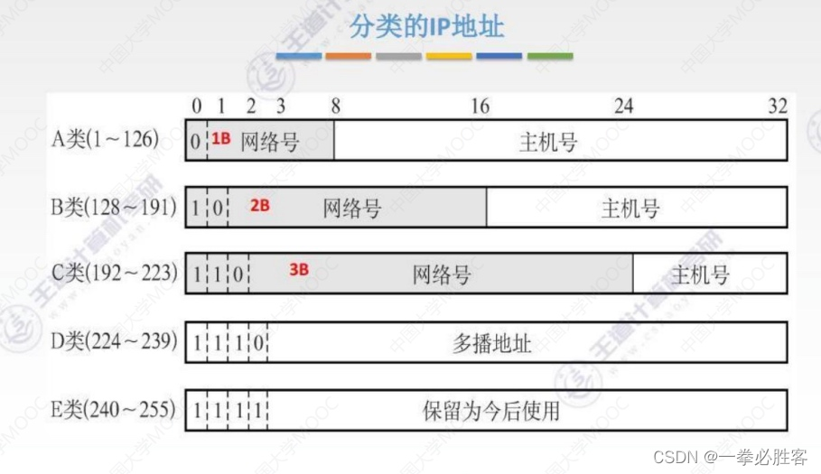
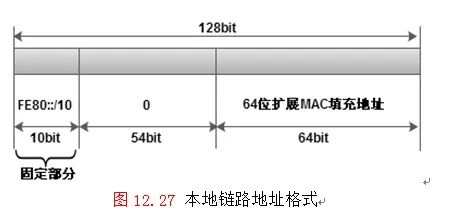
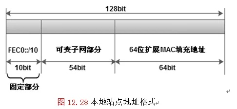
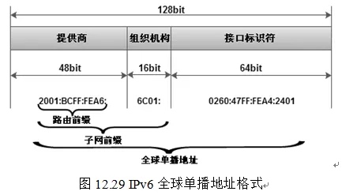
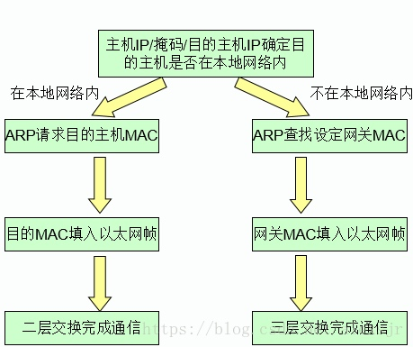

# IP网络

## IPv4

### 分类



* 单播地址（unicast）=>
* 广播地址（broadcast）=> 主机号为255
* 多播地址（multicast）=> D类IP => `224.0.0.0 - 239.255.255.255`

### 特殊IP

#### 私有地址

```
Class A: 10.0.0.0 - 10.255.255.255
Class B: 172.16.0.0 - 172.31.255.255
Class C: 192.168.0.0 - 192.168.255.255
```

#### 239.255.255.250

`udp:1900` => UPnP/SSDP(Simple Service Discovery Protocol)

路由器开启UPnP服务 => 路由器定时使用SSDP(udp:1900 => 239.255.255.250)来发现UPnP服务

=> 局域网内UPnP服务 => 定时向239.255.255.250发送udp:1900，宣告UPnP服务可用。

## IPv6

```shell
ip addr show dev ens161 | grep inet6
    inet6 240e:381:73b:7220::f63/128 scope global dynamic noprefixroute
    inet6 240e:381:73b:7220:20c:29ff:fe9e:daf0/64 scope global dynamic mngtmpaddr noprefixroute
    inet6 fe80::20c:29ff:fe9e:daf0/64 scope link
```

### 本地链路地址

无状态自动配置（不能通过DHCP获取，也没法手工配置 ）=> `FE80::/10` + `mac/64` => `FE80::/64`



### 本地站点地址

只能在当前二层链路中通信，不可被路由



### 全球单播地址

公有IP => `2000::/3` => `[0010b - 0011b)`



### 环回地址 

=> `0000:0000:0000:0000:0000:0000:0000:0001` => `::1`

### 未指定地址

 => `0000:0000:0000:0000:0000:0000:0000:0000` => `::`

### 组播地址

 => ?
 
### 任意播地址

 => ?

### EUI-64

 => `mac/48` + `FFFE`
 => `00:0c:29:9e:da:f0`
 => `00:0c:29:FF:FE:9e:da:f0`
 => `02:0c:29:ff:fe:9e:da:f0/64` (第一字节第二位取反)
 => `FE80:020c:29ff:fe9e:daf0/64`
 
 ### 禁用IPv6
 
 ```shell
#1. echo to proc
echo 1 > /proc/sys/net/ipv6/conf/all/disable_ipv6
#2. sysctl 
net.ipv6.conf.default.disable_ipv6 = 1
net.ipv6.conf.all.disable_ipv6 = 1
net.ipv6.conf.lo.disable_ipv6 = 1
#3. netplan
link-local: [ ] # no ipv6 local
#4. openwrt
uci set 'network.LAN.ipv6=0'
uci set 'network.WAN.ipv6=0'
uci set 'dhcp.LAN.dhcpv6=disabled'
uci commit 
```

## MTU & MSS 

MTU: 最大传输单元，默认为1500（以太网）或1492（PPPoE）。

**不要想当然以为现在网络都是1500，实际很多时候整个链路的MTU都小于1500。**

MSS: Maximum Segment Size = MTU - 40。

### 测试MTU

```shell
# 禁用IP分片，并带数据ping服务器
ping -M do -s 1472 <服务器地址>  # 1500 - 28

ping: local error: message too long, mtu=1492
# 这里的MTU值直接检测出来了，但不一定可靠，继续减少数据大小，直到能够ping通服务器

# MTU = ping携带的数据大小 + 28（ping报文头大小）
```

### 设置MSS

```shell
# 使用 --clamp-mss-to-pmtu
sudo iptables -I FORWARD -i n2n0 -p tcp --tcp-flags SYN,RST SYN -j TCPMSS --clamp-mss-to-pmtu
# 使用 --set-mss
sudo iptables -I FORWARD -i n2n0 -p tcp --tcp-flags SYN,RST SYN -j TCPMSS --set-mss 1350

# 修改前：
20:01:19.942146 IP ECS.54044 > 20.205.243.168.https: Flags [S], seq 951446441, win 64240, options [mss 1460,sackOK,TS val 3039480309 ecr 0,nop,wscale 7], length 0
# 修改后
20:03:16.621032 IP ECS.60406 > 20.205.243.168.https: Flags [S], seq 2888455217, win 64240, options [mss 1350,sackOK,TS val 3039596987 ecr 0,nop,wscale 7], length 0
```

## 二层转发 & 三层转发



* 二层（链路层）转发：位于同一网段，不经过路由，主要依靠MAC地址；
* 三层（网络层）转发：位于不同网段，经过路由转发，主要依靠IP地址；


## Let's Encrypt

### HTTP-01 验证

```shell
#1. 生成证书
sudo certbot certonly --webroot --agree-tos -v -t --email 邮箱地址 -w 网站根目录 -d 网站域名
# 查看证书
openssl x509 -text -noout -in /path/to/pem
#2. 更新测试
sudo certbot renew --dry-run
#3. 自动更新
sudo bash -c "cat > /etc/letsencrypt/renew.sh" << EOF
#!/bin/sh
/usr/bin/certbot renew || exit 1
# fix permissions
/usr/bin/chmod 0755 /etc/letsencrypt/live 
/usr/bin/chmod 0755 /etc/letsencrypt/archive
/usr/bin/chown www-data /etc/letsencrypt/archive/*/privkey*.pem
# reload 
/usr/sbin/nginx -s reload || exit 2
EOF
sudo chmod +x /etc/letsencrypt/renew.sh
sudo crontab -e
# 每天4点更新证书
0 4 * * * /etc/letsencrypt/renew.sh  >> /var/log/certbot-renew.log
```

### DNS-01 验证

[参考](https://www.digitalocean.com/community/tutorials/how-to-acquire-a-let-s-encrypt-certificate-using-dns-validation-with-acme-dns-certbot-on-ubuntu-18-04)

```shell
#1. 生成证书
sudo certbot certonly --agree-tos --manual --preferred-challenges=dns -m 邮箱 -d "*.域名,域名"

#2. 自动更新
wget https://github.com/joohoi/acme-dns-certbot-joohoi/raw/master/acme-dns-auth.py 
# => python -> python3 
chmod +x acme-dns-auth.py
sudo cp acme-dns-auth.py /etc/letsencrypt/

sudo certbot certonly --agree-tos --manual --manual-auth-hook /etc/letsencrypt/acme-dns-auth.py --preferred-challenges=dns --debug-challenges -d "*.域名,域名"
```

使用`dig +short -t txt _acme-challenge.域名`确认DNS记录是否生效。


## SSH

### 设置默认用户名和端口

```shell
vim ~/.ssh/config

HOST *  
     USER root
     PORT 2222
```

## mDNS 

```shell
avahi-browse -a -r  # 查看所有设备和服务
mdns-scan 
```

## 杂项

### 防暴力破解

#### fail2ban 

配置太复杂

#### sshguard 

功能简单、易用
