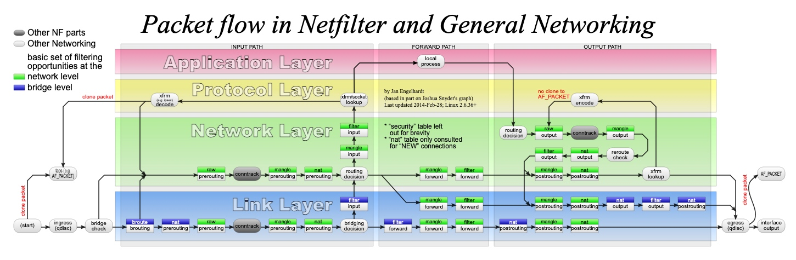

# IP网络防火墙



**不要同时直接使用`iptables`、`nftables`、`ufw`等不同工具管理网络，避免交叉影响。**

## `iptables` @ `nftables`

```shell
# 查看当前iptables的后端
ls -l $(which iptables)
# Debian/Ubuntu
sudo update-alternatives --config iptables
```

### 正确使用`iptables`

目前多数版本都已经切换到`nftables`后端，但前端支持同时使用`iptables`和`nft`。

```shell
# 通过iptables设置规则
sudo iptables -A xxx xxx

# Update 2023-08-03: 
# 不要将iptables的表（ip filter/nat/mangle）保存到nftables.conf，否则iptables与nft之间会冲突
# 将iptables规则保存为nftables规则
sudo nft list ruleset | sudo tee -a /etc/nftables.conf
# 重启之后，iptables规则看不到了，因为它们都已经转换为nftables规则
```

## 查看规则

```shell
# iptables
sudo iptables -nvS
sudo iptables -t nat -nvS 
# nftables
sudo nft list ruleset
# 手动修改，删除重复规则
```

## NAT

### DNAT 

```shell
iptables -t nat -I PREROUTING -p tcp --dport 5000 -j DNAT --to 10.10.10.200
```

### SNAT

```shell
iptables -t nat -I POSTROUTING -o eth0 -j MASQUERADE
```

### 本地NAT

```shell
iptables -t nat -I POSTROUTING -s 10.10.10.0/24 -d 10.10.10.0/24 -j MASQUERADE
```

## 桥接网络

桥接网络是在第二层进行数据转发，所以默认情况下是不会经过`iptables`/`nftables`。

```shell
modprobe br_netfilter
sysctl -w net.bridge.bridge-nf-call-iptables=0
sysctl -w net.bridge.bridge-nf-call-ip6tables=0
sysctl -w net.bridge.bridge-nf-call-arptables=0
```

**由于`br_netfilter`的依赖关系，直接写在`sysctl.conf`是不行的**