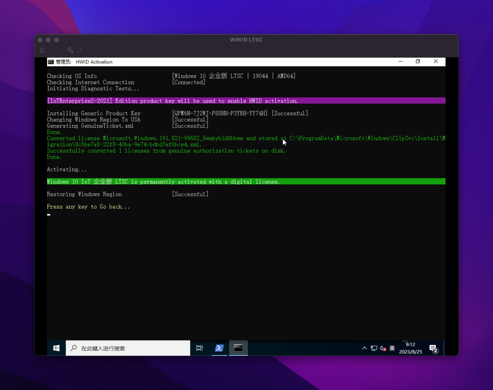

# Windows 

## 激活

1. 手动KMS激活

```shell
slmgr -ipk <SN>

slmgr -skms kms.03k.org

slmgr -ato

slmgr -dlv
```

2. 一键激活

```shell
irm https://massgrave.dev/get | iex
```


## 远程桌面

### 无密码连接

	⁃	secpol.msc - 本地策略 - 安全选项 - 帐户：使用空密码的本地帐户只允许进行控制台登陆 - 禁用

### 多用户

https://blog.csdn.net/x326279579/article/details/119159108

### 禁止用户关机

gpedit.msc - 计算机配置 - Windows设置 - 安全设置 - 本地策略 - 用户权利指派 - 关闭系统

### 禁止远程用户自动注销

gpedit.msc - 计算机配置 - 管理模板 - windows组件 - 远程桌面服务 - 远程桌面会话主机 - 会话时间限制 - 设置已中断会话的时间限制 - 禁用

### 复制与粘贴

gpedit.msc - 计算机配置 - 管理模板 - windows组件 - 远程桌面服务 - 远程桌面会话主机 - 设备和资源重定向 - 不允许剪贴板重定向 - 禁用

### 远程声音

gpedit.msc - 计算机配置 - 管理模板 - windows组件 - 远程桌面服务 - 远程桌面会话主机 - 设备和资源重定向 - 允许音频和视频播放重定向

services.msc - Windows Audio - 自动 

### 显卡加速

gpedit.msc - 计算机配置 - 管理模板 - windows组件 - 远程桌面服务 - 远程桌面会话主机 - 将三件图形我在楼下器应用于所有远程桌面服务传话 - 启用

## 挂载NFS

挂载方式和SMB一样，只是路径不同。NFS使用的是文件夹在服务器中的绝对路径！！！

```shell
\\10.10.10.200\<path of nfs directory>
```

### 中文乱码

intl.cpl - 管理 - 更改系统区域设置 - Beta 版：使用Unicode UTF-8提供全球语言支持

## NUC显卡驱动安装

错误1603 - 禁用驱动签名

https://www.zhihu.com/tardis/zm/art/333841073?source_id=1003chen1234

错误205 - 

https://www.amd.com/zh-hans/support/kb/faq/gpu-kb205