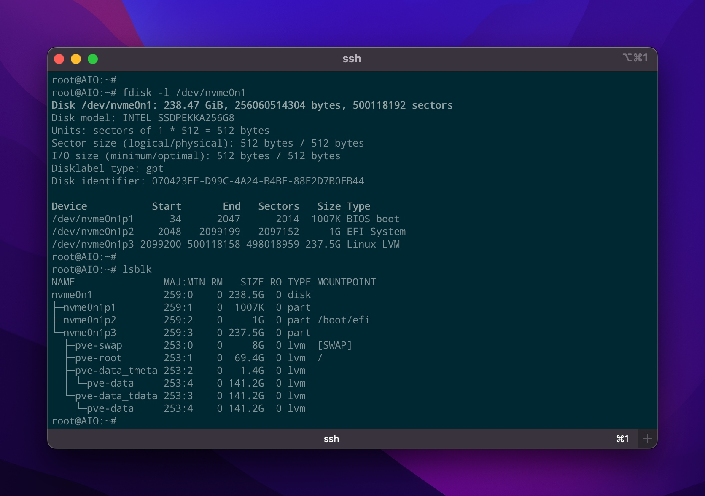
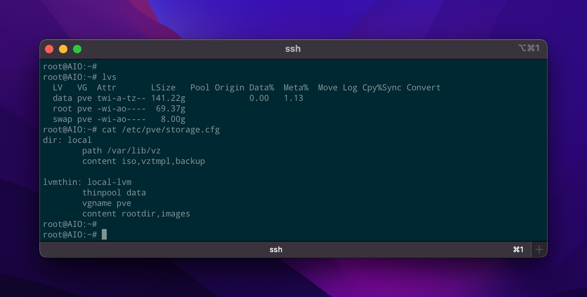
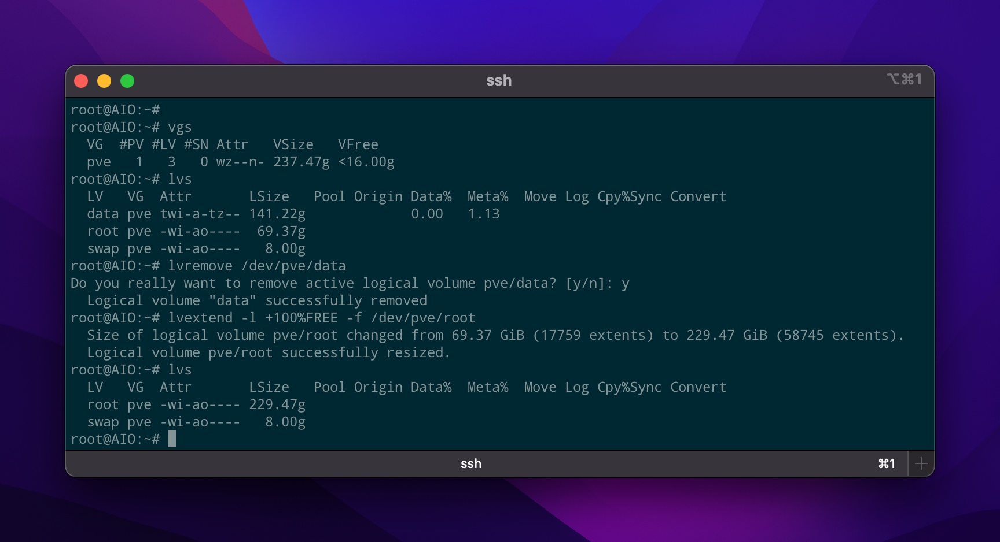
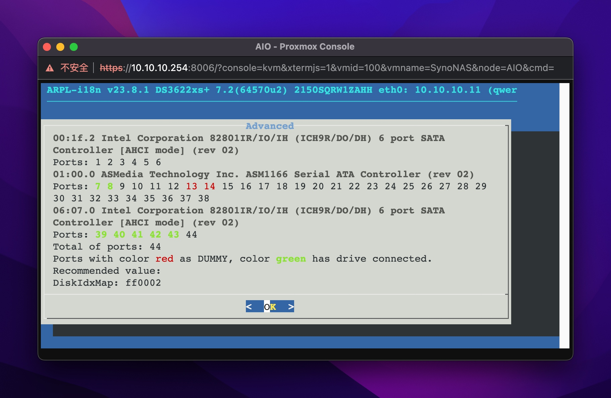

# PVE虚拟环境

## 宿主机管理

### 源管理

修改mirror、增加non-free 
sources.list

```shell
vi /etc/apt/sources.list 

deb http://mirrors.aliyun.com/debian bullseye main contrib non-free

deb http://mirrors.aliyun.com/debian bullseye-updates main contrib non-free

# security updates
deb http://mirrors.aliyun.com/debian-security bullseye-security main contrib non-free

# OR
sed -i \
    -e 's/ftp.debian.org/mirrors.ustc.edu.cn/g' \
    -e 's/security.debian.org/mirrors.ustc.edu.cn\/debian-security/g' \
    -e 's/^deb .*$/& non-free/g' \
    /etc/apt/sources.list
```

```shell
# unauthorized 
deb https://mirrors.ustc.edu.cn/proxmox/debian/pve bullseye pve-no-subscription

# OR
sed -i \
    -e 's/enterprise.proxmox.com/mirrors.ustc.edu.cn\/proxmox/g' \
    -e 's/pve-enterprise/pve-no-subscription/g' \
    /etc/apt/sources.list.d/pve-enterprise.list
```

### CPU

#### CPU性能

宿主机与虚拟机cpu性能对比

```shell
openssl speed -elapsed -evp aes-128-gcm
```

如果性能差别较大，修改`Hardware - Processors`为Host。

#### CPU睿频

```shell
watch -n 1 'cat /proc/cpuinfo | grep MHz'

# OR
apt install cpufrequtils
cpufreq-info | grep "current CPU"
```

**虚拟机中没办法查看睿频** ==> 实际虚拟机是否享受睿频？

### 温度显示

[参考](https://blog.csdn.net/xiaobo060/article/details/105930003)

```shell
# 搜索pveversion
vim /usr/share/perl5/PVE/API2/Nodes.pm 

# 搜索PVE.node.StatusView
vim /usr/share/pve-manager/js/pvemanagerlib.js

# ==> 照猫画虎

# 温度监控脚本
vim /bin/thermal.sh 
# ==> 自由编写温度字符串
# cpu核心温度
sensors coretemp-isa-0000 | sed \
		-e '/^Package id/!d' \
		-e 's/^Package id \([0-9]:  +[0-9\.]\+\)°C .*$/cpu \1 C/g' \
		-e 's/ \+/ /g'
```


刷新

```shell
systemctl restart pveproxy.service
```

**浏览器一定要关闭再重新打开web管理页**

### 磁盘管理

先了解PV/VG/LV三个概念

#### 分区结构



#### LVM



从这里可以看出来，PVE默认使用LVM，并在LVM中建立一个名为data的thinpool，以实现类似ESXi的精简置备，方便进行快照或进行空间调整。**但LVM-thin也有不友好的地方，虚拟机存储到LVM-thin是作为块设备，所以不能直接进行文件备份或迁移。**

另外，据某些测评说，LVM-thin存储效率比目录低，影响系统IO性能。这主要是因为LVM-thin缺少缓存机制，影响IO效率。

#### 删除LVM-thin

**操作前请确认data中的文件或虚拟机已经备份或迁移**

从pve中删除LVM-thin/data，并将空间返还给root。

**请注意：把空间返还给root之后，无法直接shrink，需要借助Live CD**



前后对比发现pve的可用空间变大了，这里我们就可以直接使用pve中的目录以存储虚拟机想着文件。同时，我们也必须在webui中进行相关调整。

`Datacenter - Storage - local-lvm - Remove `

`Datacenter - Storage - local - Edit - Content: 选择所有项目`

==> 如果`lvextend`少带了`-r`参数，可使用`resize2fs /dev/pve/root`调整fs大小。

#### 建立单独data分区

前提： 磁盘有剩余空间或第二硬盘

```shell
# create new physic partition 
fdisk -l /dev/nvme0n1

vgcreate data /dev/nvme0n1p4 

lvcreate -l +100%FREE -n data data

mkfs.ext4 /dev/data/data

# add mount entry
vi /etc/fstab
# append line
/dev/data/data /mnt/data ext4 defaults 0 1

mount /mnt/data
```

#### 虚拟磁盘命名

PVE好像没有提供自定义磁盘名称的方法

```shell
cd /var/lib/vz/images/200

mv vm-200-disk-0.qcow2 synoboot.qcow2
qm rescan 
# ==> 在web中重新添加硬盘
```

#### 移动虚拟磁盘

```shell
# 查看虚拟机及其配置
qm list
qm config 100

# 移动磁盘
qm disk move 100 sata0 <new-datastore> --delete
```

#### 重新添加磁盘

```shell
qm rescan
```

#### 挂载LVM

```shell 
# 查看vg相关信息
vgscan --mknodes 
vgdisplay

# 处理重名vg
vgrename D9ZdJ0-c0TF-Xad7-Ysc1-ca3e-t3Vj-lcQ0xD old

# 激活vg
vgchange -ay old 

# 查看lv相关信息
lvdisplay

# 挂载lv
mount /dev/old/root /mnt/old
```

#### 挂载虚拟磁盘

```shell
# mount
losetup --partscan /dev/loop0 /path/to/vm/disk
mount /dev/loop0p1 /mnt

# umount
umount /mnt
losetup --detach /dev/loop0
```

### 导入ESXi/VMFS

```shell
apt install vmfs6-tools

# list disks
fdisk -l

# mount vmfs 
mkdir -pv /mnt/vmfs 
vmfs6-fuse /dev/sda8 /mnt/vmfs 
```

#### 导入vmdk

```shell
#1. 直接导入vmdk
cd /mnt/vmfs
qm importdisk 100 synoboot.vmdk local -format qcow2
# ==> 不知道为什么有时会出错

#2. 分离步骤
# vmdk -> qcow2
qemu-img convert -p -f vmdk -O qcow2 /mnt/vmfs/arpl-flat.vmdk /var/lib/vz/images/arpl.qcow2
# => `-flat`这个要看qemu的版本

# 导入虚拟磁盘
qm importdisk 100 /var/lib/vz/images/arpl.qcow2 local -format qcow2


# ??? 自定义虚拟磁盘名称

# 查看虚拟磁盘
#1. PVE Storage Manager
pvesm list local

Volid                         Format  Type            Size VMID
local:100/vm-100-disk-0.qcow2 qcow2   images    1073741824 100

#2. 
tree /var/lib/vz/

/var/lib/vz/
├── dump
├── images
│   ├── 100
│   │   └── vm-100-disk-0.qcow2
│   └── arpl.qcow2
├── private
├── snippets
└── template
    ├── cache
    └── iso
```

==> 现在我们就可以在webui中添加硬盘了。

### 网络 

#### Open vSwitch

没必要，实测默认VirtIO能达到30G左右。

## 虚拟机配置

### 查看配置

```shell
qm config 100
```

### Q35 vs i440fx

Q35（2007）比i440fx（1996）更新 ==> 对比时间就不用多说了。

### SeaBIOS vs OVMF/UEFI

SeaBIOS启动很慢，尽量选择UEFI。

### VirtIO SCSI vs VirtIO SCSI single

一对多和一对一的关系，single就是控制器与硬盘1:1

**不管采用什么控制器，系统中都会显示两个6-port AHCI控制器，但其中一个无法操作**



### VirtIO NIC vs vmxnet3

VirtIO设计应该是40G，实测30G左右。

vmxnet3设计是10G，在PVE环境下实测很难保证，ESXi环境下实测在7G左右。

### NFS中文

暂时没有找到解决PVE webui中NFS中文乱码的问题。

hack: 手动挂载NFS后，再添加Dir到PVE中。

### 自定义参数

我们经常在网上看到`args: xxx`的内容

直接添加到`/etc/pve/qemu-server/<vmid>.conf`中，一行添加所有参数

```shell
qm set 100 --args "xxxx"
```

### PCI直通

[参考](https://pve.proxmox.com/pve-docs/pve-admin-guide.html#qm_pci_passthrough)

#### 开启IOMMU & VFIO

[PCI Passthrough](https://pve.proxmox.com/wiki/PCI_Passthrough#Verifying_IOMMU_parameters)

[IOMMU & VFIO](https://zhuanlan.zhihu.com/p/550698319)

[iommu=pt](https://zhuanlan.zhihu.com/p/365408539)

```shell
# IOMMU
vim /etc/default/grub 
# ==> AMD: amd_iommu=on
GRUB_CMDLINE_LINUX_DEFAULT="quiet intel_iommu=on iommu=pt"

GRUB_CMDLINE_LINUX_DEFAULT="quiet intel_iommu=on iommu=pt pcie_aspm=off pcie_acs_override=downstream,multifunction nofb textonly nomodeset initcall_blacklist=sysfb_init"

# VFIO
vim /etc/modules 
# add lines
vfio
vfio_iommu_type1
vfio_pci
vfio_virqfd

# binding vfio-pci with devices
vim /etc/modprobe.d/vfio.conf 
# add lines
# load vfio-pci early 
softdep drm pre: vfio-pci
# binding devices
options vfio-pci ids=10de:1cb3,10de:0fb9

# update & reboot
update-initramfs -u -k all && update-grub && pve-efiboot-tool refresh
reboot 

# verify
dmesg | grep -e DMAR -e IOMMU -e VFIO
lsmod | grep -e iommu -e vfio
```

#### 硬盘直通

##### RDM直通

```shell
# 查看已经连接的硬盘
lsblk -o +VENDOR,MODEL,SERIAL
ls -l /dev/disk/by-id

# 硬盘直通
qm set 100 --scsi2 /dev/disk/by-id/ata-WDC_WD10SPZX-22Z10T1_WD-WXF2A519V6P0

# 取消直通
qm unlink 100 --idlist scsi2
# OR
qm set 100 --delete scsi2
```

##### 控制器直通

```shell
# 查找控制器位置
lsblk -o +VENDOR,MODEL,SERIAL
ls -l /dev/disk/by-path | grep sdX
```

VM - Hardware - Add - PCI Device

选择对应的PCI设备，勾选`PCI-Express`

**控制器直通后排在虚拟控制器前面，所以需要一些特殊处理**

**控制器直通会导致突然掉盘** 

#### 显卡直通

```shell
# 查找PCI编号和驱动
lspci -knn | grep -A2 VGA

# 如果虚拟机启动后，驱动不是vfio-*，则添加mod黑名单
vim /etc/modprobe.d/gpu-blacklist.conf 
# add lines for driver blacklist 
# NVIDIA
blacklist nvidiafb
blacklist nouveau
# AMD
blacklist amdgpu
# Intel
blacklist snd_hda_intel
blacklist snd_hda_codec_hdmi
blacklist i915

update-initramfs -u -k all
reboot
```
Hardware - Add - PCI Device 

勾选`All Functions`和`PCI-Express`

测试Ok之后

##### 单显卡直通设置

单显卡开机时被占用，需要用`initcall_blacklist=sysfb_init`阻止simplefb加载

```shell
cat /proc/iomem | grep BOOTFB

vim /etc/default/grub 
# add cmdline options
initcall_blacklist=sysfb_init

update-grub 
reboot
```

#### USB直通

##### 控制器直通

一般系统都有多个USB控制器，首先我们要找到对应的控制器

```shell
# 查看所有控制器
lspci | grep USB

00:14.0 USB controller: Intel Corporation C610/X99 series chipset USB xHCI Host Controller (rev 05)
00:1a.0 USB controller: Intel Corporation C610/X99 series chipset USB Enhanced Host Controller #2 (rev 05)
00:1d.0 USB controller: Intel Corporation C610/X99 series chipset USB Enhanced Host Controller #1 (rev 05)
16:00.0 USB controller: ASMedia Technology Inc. ASM1142 USB 3.1 Host Controller
# ==> xHCI (USB 3.0) & EHCI (USB 2.0) x2 & USB 3.1

# 插入一个U盘
lsblk -o +VENDOR,MODEL,SERIAL
ls -l /sys/block/sda

/sys/block/sda -> ../devices/pci0000:00/0000:00:1c.6/0000:16:00.0/usb6/6-2/6-2:1.0/host0/target0:0:0/0:0:0:0/block/sda
# ==> 外置控制器 0000:16:00.0 => pcie端口 0000:00:1c.6

/sys/block/sda -> ../devices/pci0000:00/0000:00:14.0/usb4/4-6/4-6.1/4-6.1:1.0/host0/target0:0:0/0:0:0:0/block/sda
# ==> 内置控制器 0000:00:14.0
```

**后面板的USB口，一般都是连接到同一USB控制器，这种情况下，直通USB设备或端口更合适**

结论：

**USB控制器直通并不会带来性能优势**

USB设备、USB端口、USB控制器直通 @ USB 3.0/5G ==> 性能基本无差异

#### 将PCI设备返还给主机

```shell
# unbind from vfio-pci
echo "0000:0d:00.0" > /sys/bus/pci/drivers/vfio-pci/unbind
# bind to real driver again
echo "0000:0d:00.0" > /sys/bus/pci/drivers/nvme/bind
```

**前面的0000一定要带上**

##### 将usb端口返还给主机

**暂时没办法将直通后的usb端口返还给主机**

#### Fake ID

```shell
qm set VMID -hostpci0 02:00,device-id=0x10f6,sub-vendor-id=0x0000
```

## KVM & macOS 

[参考](https://www.sqlsec.com/2022/04/pve.html)

[参考](https://www.douban.com/note/532840785/?_i=4160866ZsEhVHp)

### 准备工作

#### KVM设置

**KVM 4.1及以上不需要设置ignore_msrs**

```shell
#1. 临时设置
echo 1 > /sys/module/kvm/parameters/ignore_msrs
echo 0 > /sys/module/kvm/parameters/report_ignored_msrs

#2. 永久设置（需要重启）
echo "options kvm ignore_msrs=Y report_ignored_msrs=N" > /etc/modprobe.d/kvm.conf
# ==> 这个参数好像PCI直通也需要设置？

update-initramfs -u -k all
reboot # reboot reuqired 
```

#### 准备OpenCore 

[KVM-Opencore](https://github.com/thenickdude/KVM-Opencore)

[PVE-OpenCore](https://github.com/sqlsec/PVE-OpenCore)

```shell
# 准备OpenCore
wget https://github.com/thenickdude/KVM-Opencore/releases/download/v20/OpenCore-v20.iso.gz
gunzip OpenCore-v20.iso.gz
# ==> 也可直接使用OSX-KVM提供的OpenCore
```

#### 准备BaseSystem 

[OSX-KVM](https://github.com/thenickdude/OSX-KVM)

```shell
apt install make dmg2img
git clone --depth 1 --recursive https://github.com/kholia/OSX-KVM.git

cd OSX-KVM
make BaseSystem.img
```

### 创建虚拟机

* 根据OpenCore的类型选择是CD或Disk设备
* Type: Other
* 主板：VMware/q35/UEFI
* 磁盘：SATA/256G/qcow2/SSD
* CPU：host/8 Cores

```shell
qm importdisk 203 BaseSystem.img local -format qcow2
# 如果之前未创建磁盘，可使用下面命令
qemu-img create -f qcow2 Macintosh.qcow2 256G
# ==> rename disks if you want

qm rescan
# ==> 现在可以在web中操作了

# 额外参数
qm set 203 --args "-device isa-applesmc,osk=\"ourhardworkbythesewordsguardedpleasedontsteal(c)AppleComputerInc\" -smbios type=2 -device usb-kbd,bus=ehci.0,port=2 -global nec-usb-xhci.msi=off -global ICH9-LPC.acpi-pci-hotplug-with-bridge-support=off -cpu host,kvm=on,vendor=GenuineIntel,+kvm_pv_unhalt,+kvm_pv_eoi,+hypervisor,+invtsc"
# applesmc => 
# usb-kbd => 解决键盘无法使用的问题
```

**如果OpenCore使用iso，则需要将`media=cdrom`改成`cache=unsafe`**

### 调试

为了使用PVE的web管理界面，我们不能完全使用OSX-KVM里面的脚本

我们可以使用以下命令对比PVE与OSX-KVM的参数差异，逐步调试

```shell
ps aux | grep -w "kvm -id 203"
# ==> 参数比较多，拷贝下来慢慢比较
```
## 杂项

### Color PS1 

```shell
  if [ "$(id -u)" -eq 0 ]; then
    # root user
    export PS1='[\e[31m\u@\h \e[34m\w\e[m] \e[31m\$\e[m '
  else
    # non root
    export PS1='[\e[32m\u@\h \e[34m\w\e[m] \e[32m\$\e[m '
  fi
```

### Can't lock file

```shell
rm /run/lock/qemu-server/lock-xxx.conf
qm unlock xxx
```

### PVE & DSM

DSM7: 在虚拟机上添加一个串行端口，可以修复PVE系统里直接安全关闭群晖虚拟机

DSM6/7均无需也无法安装qemu-guest-agent，注意：DSM7引导编译带上acpid2，DSM6安装Power button套件。

== 2023.11.23 

参考[这里](https://xpenology.com/forum/topic/69482-qemu-guest-agent-install/)：添加[https://spk7.imnks.com](https://spk7.imnks.com)，然后安装`QEMU Guest Agent`

### Web管理界面一片空白

```shell
apt install --reinstall proxmox-widget-toolkit pve-manager
```

居然有这么弱智的BUG

## 关于PVE的一点想法

先上结论：强大，但强大的不是PVE，而是Debian/Linux + KVM。

本质上来讲，PVE是一个有想法的菜鸟，提供一套不成熟的方案来管理Debian & KVM。目前来看，该方案勉强Ok，但仅仅是勉强而已，无论从终端还是WEB管理，无处不体现其不成熟之处。比如，其用数字VMID来标识虚拟机，导致我们无论在终端还是WEB中，都需要组合信息才能正确识别操作对象；PVE顶层的Datacenter表明其是面向存储的，但实际并没有实现这一点，其Storage概念比较原始，而且自创的抽象层与常规思维冲突，让人比较迷糊。这一点上，PVE应该向群晖学习。

不要说有多少商业方案采用的是PVE，商业谈的不是喜欢或不喜欢，而是Money。而且，商业应用必然都有二次开发。

所以呢，虽然PVE就这样，但不影响我们使用。在逐步了解了PVE的机制之后，配合Debian/Linux的基本操作，PVE仍然可以成为媲美ESXi的虚拟平台，甚至在某些方面超过前者。