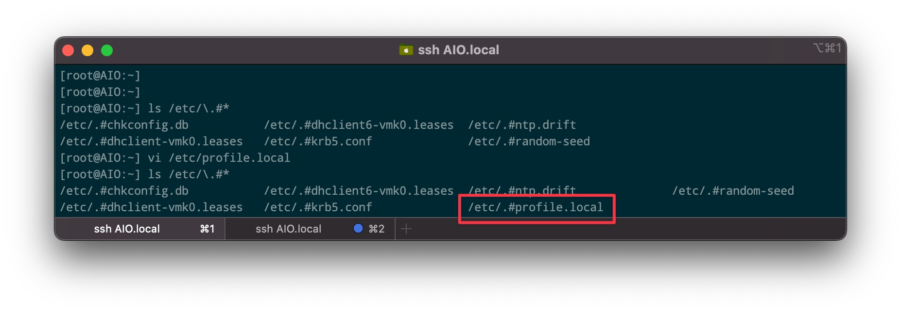
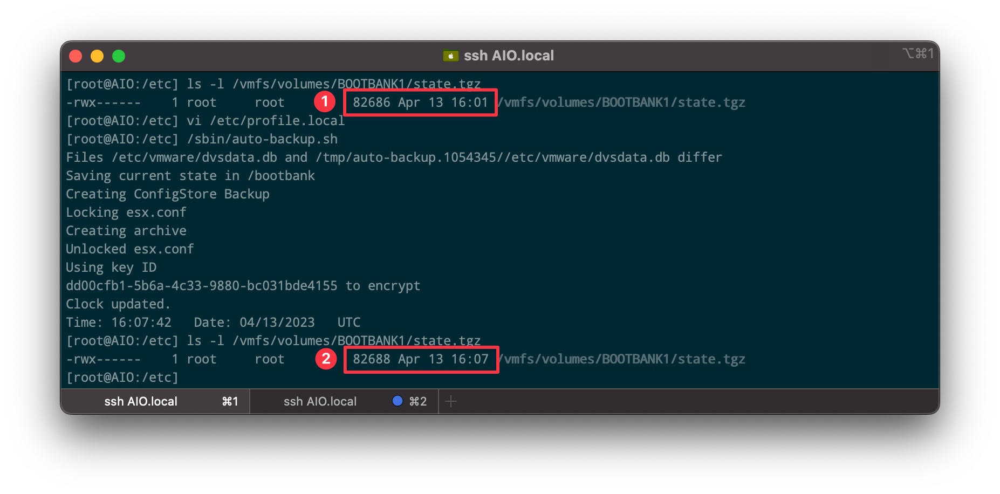
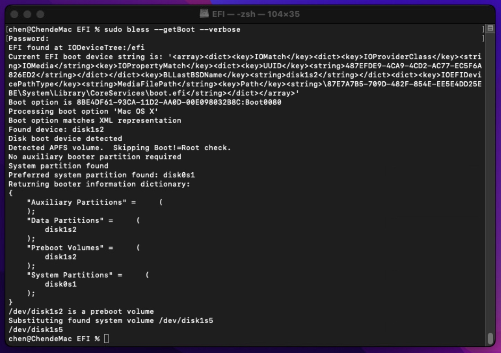
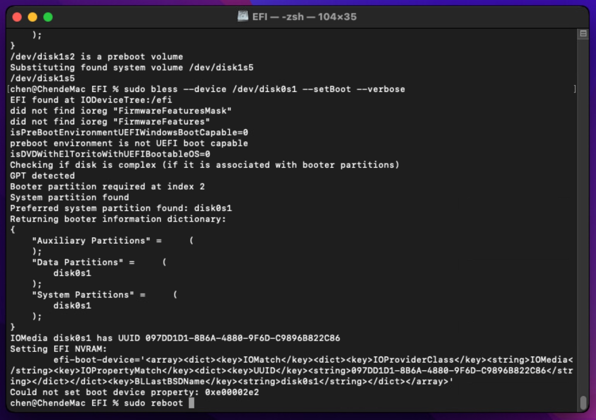
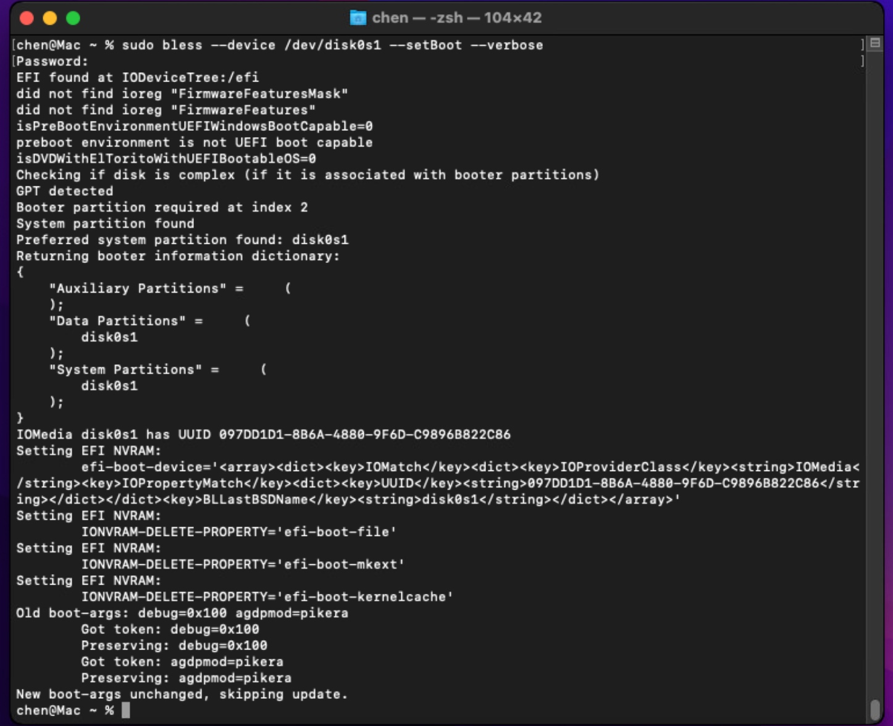

# ESXi虚拟环境

## 安装参数 

`SHIFT + O`

* allowLegacyCPU=true
* autoPartitionOSDataSize=4096  减少VMFSL分区大小，似乎低于4096不起作用

## 更新

```shell
#1. 
esxcli software sources profile list -d <full-path-to-zip-file>
esxcli software profile update -d <full-path-to-zip-file> --profile=<profile-name-from-above-output>
#2. 
esxcli software vib update -d <full-path-to-zip-file>
```

## 备份

[OVFTOOL](https://customerconnect.vmware.com/downloads/get-download?downloadGroup=OVFTOOL443)

```shell
ovftool vi://username:password@ip:443/path/to/vm vm.ova
```

## 设置主机名

[参考](https://superuser.com/questions/1757653/configure-vmware-esxi-host-to-broadcast-its-domain-name-like-avahi-on-linux)

```shell
esxcli system hostname set --host=AIO.local
esxcfg-advcfg -s AIO /Misc/hostname
esxcfg-advcfg -s AIO /Misc/PreferredHostName

# test in another pc with:
nslookup <ip> 
nslookup <hostname>.local

```

## 安装证书

```shell 
cp cert.pem /etc/vmware/ssl/rui.crt
chmod 0644 /etc/vmware/ssl/rui.crt

cp privkey.pem /etc/vmware/ssl/rui.key
chmod 0400 /etc/vmware/ssl/rui.key
```

## 开启ssh和rsa验证

* 开机启动ssh服务：`主机 - 管理 - 服务 - TSM-SSH - 随主机启动和停止`

* 添加rsa密钥

```shell
vi /etc/ssh/keys-root/authorized_keys 
# => add id_rsa.pub content into this file
/etc/init.d/SSH restart
```

## 安装usb网卡驱动

[参考](https://www.linuxsysadmins.com/adding-usb-network-adapter-to-esxi-7/)

```shell 
# ESXi 7.0.3
wget https://download3.vmware.com/software/vmw-tools/USBNND/ESXi703-VMKUSB-NIC-FLING-55634242-component-19849370.zip

scp ESXi703-VMKUSB-NIC-FLING-55634242-component-19849370.zip root@<ip>:/tmp/ 

# ssh into ESXi
esxcli software component apply -d /tmp/ESXi703-VMKUSB-NIC-FLING-55634242-component-19849370.zip

reboot 

# check 
lsusb 
esxcli network nic list

Name    PCI Device    Driver  Admin Status  Link Status  Speed  Duplex  MAC Address         MTU  Description
------  ------------  ------  ------------  -----------  -----  ------  -----------------  ----  -----------
vmnic0  0000:04:00.0  ntg3    Up            Up            1000  Full    68:fe:f7:0f:e5:09  1500  Broadcom Corporation NetXtreme BCM57766 Gigabit Ethernet
vusb0   Pseudo        uether  Up            Up            1000  Full    00:e0:5c:68:00:76  1500  Realtek USB 101001G2.5G LAN

# bind vusb0 with mac，否则下次启动vusb0这个名称会变化
esxcli system module parameters set -p "vusb0_mac=00:0e:c6:fa:8b:38" -m vmkusb_nic_fling

# usb网卡在重启之后，vSwitch的上行链路会掉，通过以下命令可添加回去
esxcfg-vswitch -L vusb0 vSwitch1

# webui中查看，vSwitch还是没有上行链路
/etc/init.d/hostd restart
```

## PCI直通理论

[](https://kb.vmware.com/s/article/2047927)

[](https://kb.vmware.com/s/article/2142307)

直通命令

```shell
esxcli hardware pci pcipassthru list
esxcli hardware pci pcipassthru set -a -d <PCIE地址> -e TRUE
```

系统 - 高级设置 `VMkernel.Boot.disableACSCheck:TRUE`（解决"已启用/需要重新引导"）

### pciSlotNumber 

```
160 (reserve this for scsi0 ! )

192

224

or

1184

1216 .... (next slot = current slot + 32 )
```

## 开启硬盘直通

### RDM直通

通过RDM（Raw Device Mapping）方式，将磁盘应设为本地VMDK

优点：不需要增加硬件和修改任何配置文件，配置起来很易用

缺点：如果需要对硬盘调整，需要重新映射；群晖无法获取到SMART信息

```shell
vmkfstools -z /vmfs/devices/disks/t10.ATA_____WDC_WD20EFRX2D68EUZN0_________________________WD2DWCC4M0YD5PZH /vmfs/volumes/iSystem/iSynoNAS/iSynoNAS.vmdk

# 然后将虚拟硬盘添加到虚拟机即可

# 不要移动rdmp.vmdk文件，正确的方法：
# 1. 删除原有rdmp.vmdk
vmkfstools -U xxx.vmdk
# 重新连接原来的磁盘
vmkfstools -z xxxx xxxx.vmdk
```

#### 快照

将硬盘排除在快照之外，更改磁盘模式：


### PCIE直通

通过修改/etc/vmware/passthru.map配置文件实现

优点：可以对几乎任何所有的PCIE设备直通；不需要担心磁盘顺序等

缺点：如果对AHCI设备配置，会对整个设备映射，无法单独对某块硬盘；需要修改ESXI系统配置文件；部分不支持SMART信息；需要预留内存空间

```shell
vi /etc/vmware/esx.conf
# add lines:
/device/0000:00:31.2/owner = "passthru"
# ==> 这里是16进制

vi /etc/vmware/passthru.map
# add lines:
# Intel SATA Controller
8086  8c02  d3d0     default
```

如果你是想做软raid，不建议做PCIE直通，相对vmdk带来的性能下降，软raid性能下降要高得太多，不在一个数量级之上。而PCIE直通带来的负作用却很大，比如板载NGFF可能就不工作了。

= Updated 20230502: NGFF莫名其妙的开始工作了。板载M2当SSD缓存也不错。


## 显卡直通+HDMI输出

注意：**虚拟机硬件兼容性：ESXi 6.7 虚拟机**，ESXi 7.0直通很难。

高级设置：`hypervisor.cpuid.v0:FALSE`（欺骗显卡此时身处环境不为虚拟环境）

显卡驱动安装好后，可禁用SVGA：`svga.present:FALSE`

```shell
# headless
esxcfg-advcfg --set-kernel "TRUE" ignoreHeadless
esxcli system settings kernel set -s vga -v FALSE

vi /etc/vmware/esx.cfg

# 添加如下行，保证开机之后自动直通显卡
/device/0000:03:00.0/owner = "passthru"

vi /etc/vmware/passthru.map

# GT 640
10de  0fc1  d3d0     false

# start dcui from ssh
TERM=xterm
dcui
```

### VBIOS

高级设置

`pciPassthru0.filename = ""`

`pciPassthru0.opromEnabled = "TRUE"`


## 禁用设备热插拔 （WIN10）

Win10虚拟机中所有设备均显示可弹出，一不小心点错了就坏了。

添加参数 `devices.hotplug = "FALSE"`可解决

## USB直通

### USB设备直通 

```shell
$ lsusb -t -v # 查看USB设备

$ /etc/init.d/usbarbitrator status # 查看服务状态 
$ /etc/init.d/usbarbitrator start  # start the service otherwise

# 如果 `lsusb`很慢或无法更新设备，执行`/etc/init.d/usbarbitrator restart`
```

= 编辑 - 添加其他设备 - USB设备

优点：简单，甚至不需要重启虚拟机（ESXi 6.7 only）；缺点：重启后失效。

= 禁用VMkernel对usb设备获取控制权 update 2023.8.23

```shell
vi /bootbank/boot.cfg

# 编辑kernelopt
CONFIG./USB/quirks=0x<厂商ID>:0x<设备ID>::0xffff:UQ_KBD_IGNORE:0x<厂商ID>:0x<设备ID>::0xffff:UQ_KBD_IGNORE

```


### USB控制器直通

参考[显卡直通](/notes/esxi.html#%E6%98%BE%E5%8D%A1%E7%9B%B4%E9%80%9Ahdmi%E8%BE%93%E5%87%BA)将USB控制器/PCI直通给虚拟机。

```shell 
# USB xHCI/EHCI Class ID 0xc03
lspci -v | grep -B1 0c03

vi /etc/vmware/passthru.map
vi /etc/vmware/esx.conf
```

== 2023.08.30 控制器直通导致网络掉线

https://woshub.com/vmware-esxi-usb-device-passthrough-to-virtual-machine/

虚机机 BIOS 设置 XHCI - smartauto - Enabled 

	⁃	

缺点：需要编辑配置文件，需要重启主机和虚拟机；优点：重启后仍然有效，且对所有USB设备有效。

USB直通的要求比较低，没显卡要么严格，基本所有版本都能一次成功。

PS：现在主板怎么设计的，在ESXi查看到3个USB控制器，结果所有8个USB接口都在一个控制器上面。

## 模拟usb

```shell
# create a use image 
vmkfstools -c 16G -d thin virt-usb-key.vmdk

# 虚拟机 - 编辑 - 高级设置
# USB 3.0
usb_xhci:0.present          TRUE
usb_xhci:0.deviceType       disk
usb_xhci:0.fileName         virt-usb-key.vmdk
usb_xhci:0.readonly         FALSE

# USB 2.0
ehci:0.present          TRUE
ehci:0.deviceType       disk
ehci:0.fileName         virt-usb-key.vmdk
ehci:0.readonly         FALSE
```

## 关闭IPv6

```shell
esxcli system module parameters set -m tcpip4 -p ipv6=0
```


## img <-> vmdk

* macOS

```shell
brew install gzip qemu 

gunzip /path/to/*.img.gz 

# img -> vmdk/VMware Workstation
qemu-img convert -f raw -O vmdk /path/to/*.img /path/to/*.vmdk 

# upload .vmdk to ESXi
$ vmkfstools -i original.vmdk new.vmdk -d thin
```

* Windows

StarWind V2V Converter

这个比命令行的好用，支持各种虚拟机格式转换，而且支持直接连接ESXi。

## Driver

```shell
esxcli system module list

esxcli system module set --enabled=true --module=native_driver_name

esxcli system module set --enabled=false --module=native_driver_name

# Get a Driver Version:
esxcli software vib get -n native_driver_name
```

## 修改和保存配置文件

[参考](https://kb.vmware.com/s/article/2001780)




## 空间回收

精简置备vmdk文件容量是随着写入置备增加，即虚拟机某个时间使用磁盘达到历史峰值后，即便删除文件，甚至格式化磁盘，vmdk文件所占用的空间依然是历史峰值容量。删除操作是在OS层面进行的，但是虚拟化底层并不能感知这个删除操作，因此也就不会回收。

* 由于Windows不会将磁盘区块置零，所以我们需要借助SDelete工具

```shell
> sdelete -z <盘符>
```

* Linux 

先查看好需要置零的vmdk大小，减去`df -h`显示的使用量，通过`dd`命令写入足够量的zeros：

```shell
dd if=/dev/zero of=/mounted-volume/zeroes bs=1G count=N && rm -f /mounted-volume/zeroes
```

* 回收vmdk置零空间

将虚拟机关机，然后进入SSH执行：

```shell
vmkfstools -K /path/to/vmdk
```

### 通过OVF回收磁盘空间

将虚拟机导出为OVF，再导入，简单而暴力！！！

## macOS


### 制作ISO

[macOS下载](https://support.apple.com/zh-cn/HT211683)

[参考](https://www.nakivo.com/blog/run-mac-os-on-vmware-esxi/)

Monterey 12.4.8

```shell
sudo -i

hdiutil create -o Monterey -size 16384m -volname Monterey -layout SPUD -fs HFS+J

hdiutil attach Monterey.dmg -noverify -mountpoint /Volumes/Monterey

/Applications/Install\ macOS\ Monterey.app/Contents/Resources/createinstallmedia --volume /Volumes/Monterey --nointeraction

hdiutil eject -force /Volumes/Install\ macOS\ Monterey

# 这里可以使用磁盘工具压缩dmg（清除空余空间）

hdiutil convert Monterey.dmg -format UDTO -o Monterey.cdr

mv Monterey.cdr Monterey_12.4.8.iso 
```

### unlocker 

https://github.com/DrDonk/esxi-unlocker

### 高级参数

```shell
board-id.reflectHost = "FALSE"
board-id = Mac-27AD2F918AE68F61

hw.model.reflectHost = "FALSE"
hw.model = MacPro7,1
serialNumber.reflectHost = "FALSE"
serialNumber = F5KZR05YP7QM
smbios.reflectHost = "FALSE"
smbios.use12CharSerialNumber = TRUE

uuid.action =“keep”
```

* vmxnet3 - 10G网卡
* smc.version = "0" - 解决无限重启的问题
* 暂时不能添加`hypervisor.cpuid.v0=FALSE`，会导致无法安装系统

#### 加载vBIOS

```shell
pciPassthru0.opromEnabled = TRUE
pciPassthru0.filename = /vmfs/volumes/datastorehere/vmnamehere/vgaromwithoutheader.rom

# ？？
pciPassthru0.msiEnabled = "FALSE"
pciPassthru1.msiEnabled = "FALSE"
pciPassthru.64bitMMIOSizeGB = 16
pciPassthru.use64bitMMIO = "TRUE"
```

最好使用GPU-Z提取当前版本的vBIOS，不同版本可能导致无法直通。

### 安装macOS

略

### 安装VMware Tools 

[下载](https://customerconnect.vmware.com/downloads/details?downloadGroup=VMTOOLS1210&productId=1259&rPId=102595)、解压、上传至ESXi


```shell
mv darwin.iso* /usr/lib/vmware/isoimages/
```

/Library/Application Support/VMware Tools/vmware-tools-daemon

添加到`安全与隐私 - 辅助功能`

### OpenCore

OpenCore 

下载：[Vmware-ESXi-OpenCore](https://github.com/sqlsec/Vmware-ESXi-OpenCore)

```shell
diskutil list 

sudo diskutil mount /dev/disk0s1
```

拷贝`EFI`

```shell
sudo bless --getBoot --verbose 


# bless 
sudo bless --mount /Volumes/EFI --file /Volumes/EFI/EFI/BOOT/Bootx64.efi--setBoot  --verbose 
# OR
sudo bless --device /dev/disk0s1 --setBoot --verbose
```






```shell
# 进入Recovery
sudo nvram "recovery-boot-mode=unused" 

# 完成后
sudo nvram -d recovery-boot-mode

# OR：使用安装光盘关闭sip

csrutil disable 
csrutil authenticated-root disable 
```




## ESXi & MacMini 

### NVMe

[Community NVMe Driver for ESXi Fling](https://williamlam.com/2021/02/apple-nvme-driver-for-esxi-using-new-community-nvme-driver-for-esxi-fling.html)

### Thunderbolt 3

[参考](https://williamlam.com/2020/02/update-on-esxi-on-apple-mac-mini-2018-mac-pro-2019.html)

```shell
# ESXi 6.7 未验证
esxcli system settings kernel set -s pciExperimentalFlags -v 16
```

