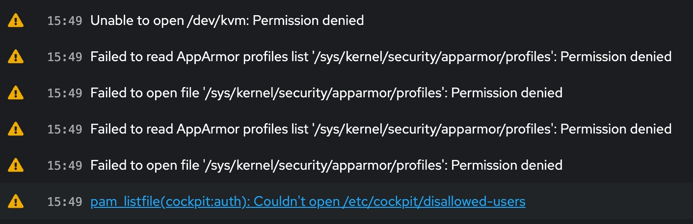

# KVM (Kernel-based Virtual Machine)

## 安装

[参考](https://www.tecmint.com/install-kvm-on-ubuntu/)

```shell
#1. cpu check
grep "vmx\|svm" /proc/cpuinfo
#2. kvm check
sudo apt install cpu-checker && kvm-ok
#3. install kvm
sudo apt install qemu qemu-kvm
#4. install libvirt -> vm manager
sudo apt install libvirt-daemon libvirt-clients
#5. install cockpit -> frontend
sudo apt install -t jammy-backports cockpit cockpit-machines
#6. post check 
lsmod | grep kvm
systemctl status qemu-kvm.service
systemctl status libvirtd.service
```

### `cockpit`设置

[参考](../os/cockpit.md)

设置好`cockpit`之后，接下来的操作我们均可以在`cockpit`中完成了，包括命令行操作！

## 权限修改



```shell
sudo usermod -aG kvm,libvirt $LOGNAME
# => 也可以直接在Cockpit中修改
sudo apt install -t jammy-backports cockpit-machines
# => 一定要加上`-t jammy-backports`，默认仓库中的版本可能太低了
```

### 存储池权限

**无法使用存储池中的镜像，但直接使用文件路径可以** => WHY?

### `*** path must not be empty`

`sudo usermod -aG libvirt libvirtdbus`

### `Cannot access storage file 'xxxx' (as uid:64055, gid:108): Permission denied`

检查`/etc/libvirt/qemu.conf`中`user`和`group`设置，可改成`root`，然后重启`libvirtd.service`。

### `Cannot download packages whilst offline`

**如果未切换至NM，会出现如上错误**

[解决方案](https://cockpit-project.org/faq.html#error-message-about-being-offline)

## 虚拟机管理

`cockpit-machines`管理页面只有最基本的功能，如果想增强对虚拟机的管理可以使用`virsh`或通过远程桌面使用`virt-manager`。


## 磁盘管理

### Raid

单盘丢失，但实际是存在的

```shell
cat /proc/mdstat

md127 : active raid5 sdc1[2] sdb1[1] sdd1[4]
      2929886208 blocks super 1.2 level 5, 512k chunk, algorithm 2 [4/3] [_UUU]
      bitmap: 2/8 pages [8KB], 65536KB chunk

# sda: AAAA => 显示4个盘都正常
sudo mdadm --query --examine /dev/sda1

Array State : AAAA ('A' == active, '.' == missing, 'R' == replacing)

# sdb: .AAA => 显示第1个盘丢失
sudo mdadm --query --examine /dev/sdb1

Array State : .AAA ('A' == active, '.' == missing, 'R' == replacing)

# 似乎是由于某种错误操作导致第一个盘丢失，将其添加回去
sudo mdadm --add /dev/md127 /dev/sda1
```

## USB直通

支持USB热插拔，不用关机可直接添加/移除USB设备（这点比`ESXi`强）。但是无法直通USB总线/Port到虚拟机中，即使直通了也无法正常工作。`lsusb`显示其被加载了`usbfs`驱动，而非hub相关驱动，可能与此有关。

```
lsusb -t 

Port 6: Dev 3, If 0, Class=Hub, Driver=usbfs/0p, 5000M
```

**USB插入/拔出后网页需要刷新。**

**添加完USB后，USB拔出后再插入无效，需要重新添加设备**


## PCI直通

### 开启`IOMMU`

未开启`IOMMU`虚拟机启动时会有错误：`unsupported configuration: host doesn't support passthrough of host PCI devices`

```shell
journalctl -b -k -g DMAR -g IOMMU
```

解决办法：修改`cmdline`，添加参数`intel_iommu=on iommu=pt`，AMD参数为`amd_iommu=on`。

```shell
sudo vim /etc/default/grub
# => 修改cmdline
sudo update-grub && sudo reboot
```

### 加载`vfio`

**如果vfio是编译进内核，则这步可以省略**

```shell
sudo vim /etc/modules
# => add lines

# vfio modules
vfio
vfio_iommu_type1
vfio_pci
vfio_virqfd

# 优先加载vfio-pci
sudo vim /etc/modprobe.d/vfio.conf
# => add lines

# load vfio-pci early 
softdep drm pre: vfio-pci
```

### 绑定`vfio`

绑定设备，使`vfio-pci`驱动初始化设备，并防止设备在主机和虚拟机之间来回切换。

```shell
# 查看设备id
lspci -nnk

#1. 方法一
sudo vim /etc/modprobe.d/vfio.conf
# => add lines

# binding devices
options vfio-pci ids=1002:67e3,1002:aae0,1b21:1166

sudo update-initramfs -u -k all

#2. 方法二
sudo vim /etc/default/grub
# => 将`vfio-pci.ids`添加到`cmdline`

GRUB_CMDLINE_LINUX_DEFAULT="... vfio-pci.ids=ids=1002:67e3,1002:aae0,1b21:1166 ..."

sudo update-grub
```

**vfio-pci.ids设置可能不生效，两种方法都有可能，原因待查。**

### 显卡直通

**显卡直通更复杂一些，没有设置好直接添加显卡直通会导致整个`libvirt`无响应。这时需要删除`/etc/libvirt/qemu/`和`/etc/libvirt/qemu/autostart/`下对应文件并重启主机进行修复**

**显卡直通要求`UEFI`**

[参考1](https://wiki.archlinux.org/title/PCI_passthrough_via_OVMF)

[参考2](https://pve.proxmox.com/wiki/PCI_Passthrough)

[参考3](https://wiki.gentoo.org/wiki/GPU_passthrough_with_libvirt_qemu_kvm)

显卡直通的`cmdline`：`intel_iommu=on iommu=pt pcie_aspm=off pcie_acs_override=downstream,multifunction`

#### 屏蔽显卡驱动

**`vfio-pci ids`似乎并没按所说的那样工作，开机之后并未接管设备**

==> 目测是`vfio.conf`并没有生效，将`vfio-pci.ids`添加到`cmdline`中就好了。

**实在无法解决，可以直接屏蔽显卡驱动**

```shell
# 查找PCI编号和驱动
lspci -knn | grep VGA

# 如果虚拟机启动后，驱动不是vfio-*，则添加mod黑名单
sudo vim /etc/modprobe.d/gpu-blacklist.conf 
# add lines for driver blacklist 
# NVIDIA
blacklist nvidiafb
blacklist nouveau
# AMD
blacklist amdgpu
# Intel
blacklist snd_hda_intel
blacklist snd_hda_codec_hdmi
blacklist i915

update-initramfs -u -k all
reboot
```

#### 主显卡直通


### 重启确认

最终的`cmdline`：`quiet intel_iommu=on iommu=pt pcie_aspm=off pcie_acs_override=downstream,multifunction vfio-pci.ids=1002:67e3,1002:aae0,1b21:1166`

```shell
lspci -nkk | grep -B2 vfio-pci
```

## 其他

### Secure Boot 

https://www.smoothnet.org/disable-secure-boot-from-virt-install/

**默认开启了`Secure Boot`，不知道是`libvirt`还是`cockpit`的作用？**

可通过`grub`启动选项进入`UEFI`关闭`Secure Boot`。

### `getaddrinfo(::1,5901): Address family for hostname not supported`

我们没有开启IPv6，但libvirtd一直尝试`getaddrinfo(::1,5901)`，只要找到相应地址并改成IPv4就可以了。

```shell
sudo grep -R "::1" /etc/libvirt
```


